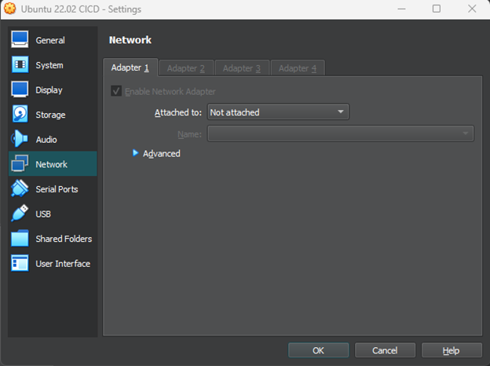
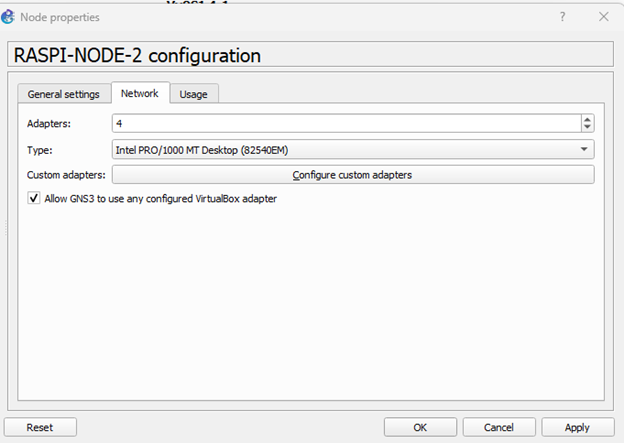
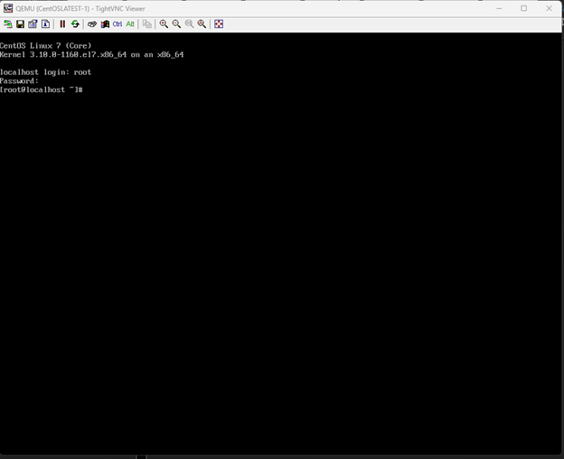
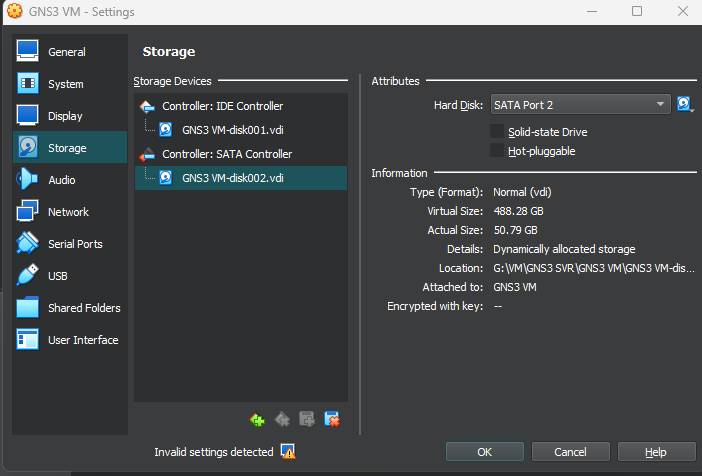
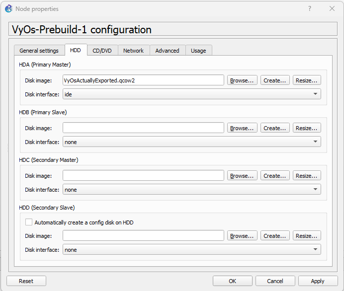
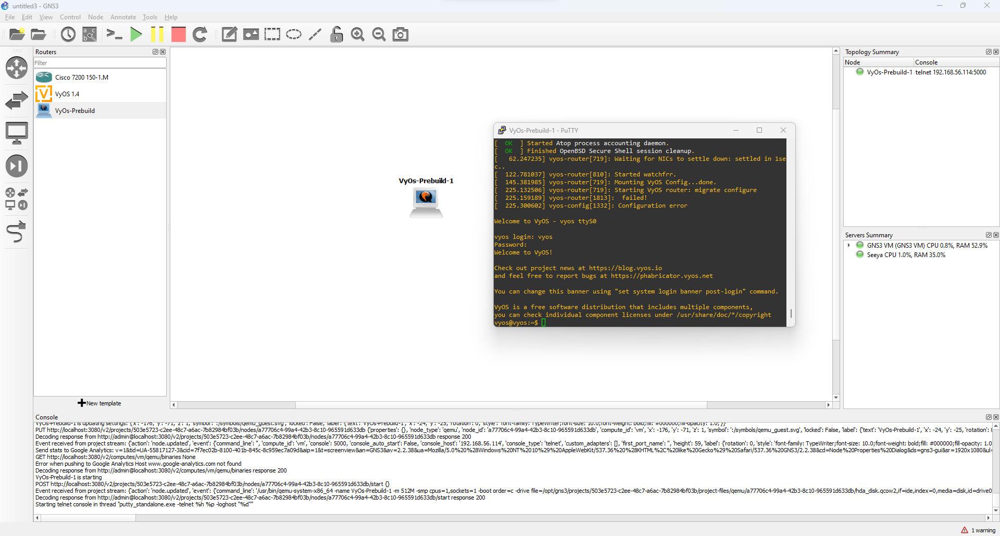

# Import a konfigurace applience do GNS3

## Zadání

Cílem tohoto návodu je export a import jakékoliv virtuální applience do emulátoru GNS3

## Řešení 1 -  Import applience z virtual boxu

1.Vypnout interface anebo je nastavit na not attached

2. Nastavit VM applience v GNS3
a.	V nastavení edit -> preferences -> new
b.	Run VM locally (resp. na HOST OS)
c.	VM list by měl být napojený na virtualbox. Stačí vybrat virtální stroj který chceme spustit
d.	Po dokončení můžeme appliance přetáhnout do GNS projektu.
e.	Před tím než appliance spustíte musíte přes pravý klik na appliance -> configuration -> network -> Allow GNS3 to use configured Virtual box network adapter

##Problémy s prvním řešením

* Ideálně moc neoperovat s VM přes virtual box manager -> GNS3 přebýrá kontrolu nad Virtuálním strojem
* NEDĚLAT SNAPSHOTY -> GNS3 hodně vadí, když má virtuální stroj snapshot. Vypadá to, že pokud se nemůže GNS dostat na fyzický disk který není image snapshotu tak odmítne spustit stroj

## Řešení 2 -  Vytažení disku z qemu

Tento způsob je trochu odlišný od prvního a hodí se, pokud potřebujeme něco spustit v qemu a zároveň to mít nastavené, jak potřebujeme.

Velký pozor z mého testování jsem vypozoroval že je mnohem lepší nechat qemu v GNS udělat podstatné nastavení. Což znamená že GNS potřebuje pouze iso nebo nějaké instalační médium. Demostrace bude na operačním systému VyOS ale předpřipravil jsem i CentOS7 appliance file

1.	Vytvoříme nový projekt
2.	Spustíme applience kterou chceme naimportovat
3.	Naimportujeme appliance z GNS3 appliance souboru nebo vytvoříme applience přes nastavení v GNS3

## Instalace přes appliance file

Stejný proces jako na přednáškách

1. Otevřít projekt a import appliance
2. Spustit a nainstalovat appliance

Při testování jsem došel k závěru že pokud necháme GNS3 vytvořit v qemu všechny náležitosti jako pevný disk, interface a ostatní věci tak pokud se pokusíme nainstalovat jakýkoliv jiný OS image tak nám to většinou projde. Toto je demonstrováno na appliance kterou přikládám do repozitáře.

## Instalace a vytažení již nakonfigurovaná appliance

1. Z již nainstalovaná appliance v projektu najít cestu k disku který qemu vytvoří pro tento specifický projekt.
2. Následně je potřeba zastavit virtuální appliance a z konzole najít trigger event.
3. To co hledáme v daném řádku console logu je tento parametr který je zasílán do qemu  -drive file=/opt/gns3/projects/503e5723-c2ee-48c7-a6ac-7b82984bf03b/project-files/qemu/f5c3899a-a0e0-40e9-a202-5c648513d1da/hda_disk.qcow2
4. Zavřít GNS3 emulátor a appliance a najít virtální disky, které jsou přiraženy GNS3 appliance. GNS3 má dva disky tudíž musíme najít ten který má větší kapacitu

5. Následně stačí otevřít disk v aplikaci 7zip nebo jiné a dostat se do adresáře s projektem. Specificky pro můj příklad to je gns3\projects\503e5723-c2ee-48c7-a6ac-7b82984bf03b\project-files\qemu\f5c3899a-a0e0-40e9-a202-5c648513d1da\hda_disk2.cow
6. Překopírovat disk na plochu nebo rovnou na server kde bude dostupný.
7. Při importu je potřeba pouze specifikovat disk který jsme extrahovali z GNS3. VyOSExported appliance file

Disk který jsem vyextrahoval z VM teď když virtuální stroj spustím.

Po spuštění máme již nasinstalovaný systém VyOS a můžeme pracovat.

## DISCLAIMER

Je hodně velká možnost že postupy nebudou fungovat jelikož GNS3 emulátor není dostatečně dokumentovaný. Všechny tyto postupy jsou nápady které jsem dostal během reverse engineeringu tohoto emulátoru.